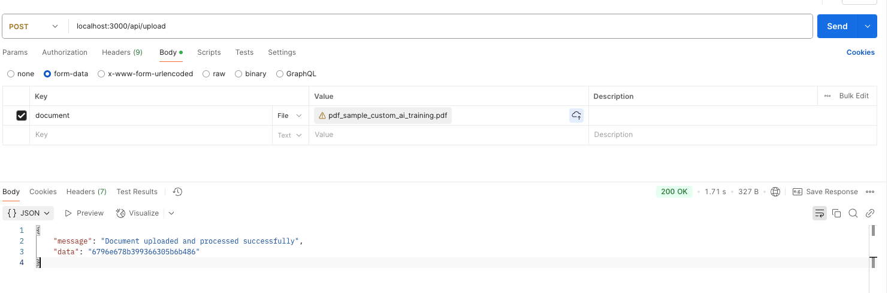

# Document Upload & Q&A Service

This project allows users to upload PDF documents, process them, and ask questions based on the contents using embeddings. The application uses OpenAI's API for question answering and MongoDB for document storage.

## Features

1. **Upload Document**: Upload PDF documents for processing.
2. **Ask Question**: Ask questions based on the contents of the uploaded document.

## Requirements

Before running the application, ensure that you have the following installed:

- **Docker**: To containerize and run the services.
- **Node.js**: For development purposes (if running outside of Docker).
- **Docker Compose**: For managing multi-container Docker applications.

## Setup

### 1. Clone the Repository

Clone the repository to your local machine:

```bash
git clone https://github.com/your-repo-url.git
cd your-repo-folder
```

### 2\. Create the `.env` File

In the root of your project, create a `.env` file and add the following environment variables:

env

```bash
PORT=3000
MONGO_URI=mongodb://mongo:27017/mydatabase
REDIS_HOST=redis
REDIS_PORT=6379
OPENAI_API_KEY=your-openai-api-key-here
```

Replace `your-openai-api-key-here` with your actual OpenAI API key.

### 3\. Using Docker and Docker Compose

To run the application using Docker, simply run the following command to build and start the containers:

bash

`docker-compose up --build`

This will build and start three services:

- **app**: Your application service, which will expose port 3000.
- **mongo**: A MongoDB container for document storage.
- **redis**: A Redis container used by the application.

Once the services are running, your application will be available at `http://localhost:3000`.

### 4\. Running the Application Locally (Without Docker)

If you'd prefer to run the application locally, you can follow these steps:

1.  Install dependencies:

    `npm install`

2.  Start the application:

    `npm start`

The app will be available at `http://localhost:3000`.

---

## API Endpoints

### 1\. **Upload Document**

- **Endpoint:** `POST /api/upload`
- **Content-Type:** `multipart/form-data`
- **Form Data Key:** `document`
  - **Type:** File (Upload PDF document)
- **Description:** Upload a PDF document to the server for processing.

**Example Request:**

`curl -X POST -F "document=@path/to/your/file.pdf" http://localhost:3000/api/upload`



### 2\. **Ask Question**

- **Endpoint:** `POST /api/question`

- **Payload:**

```json
{
  "embeddingId": "6796e678b399366305b6b486",
  "question": "Who is the CTO of the program?"
}
```

- **Description:** Ask a question based on the uploaded document. The system will return an answer using the stored embeddings.
